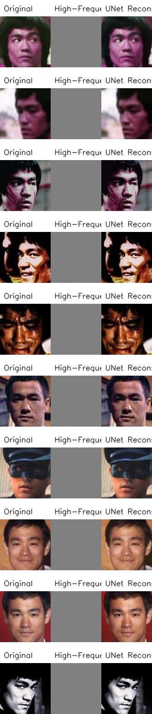
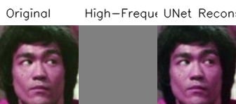
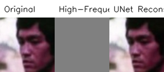
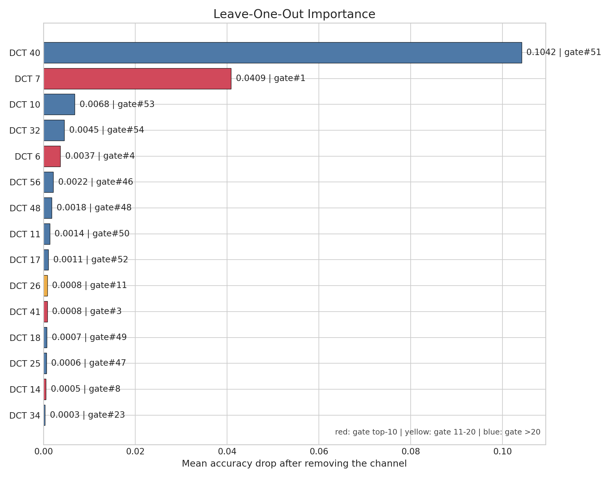
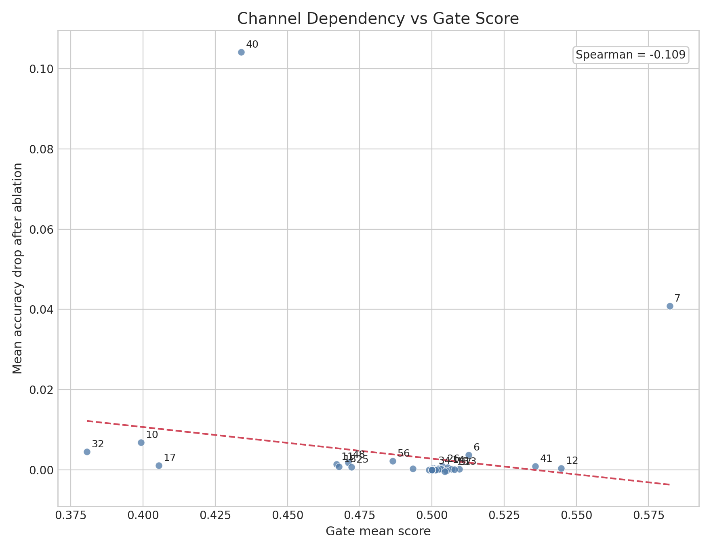
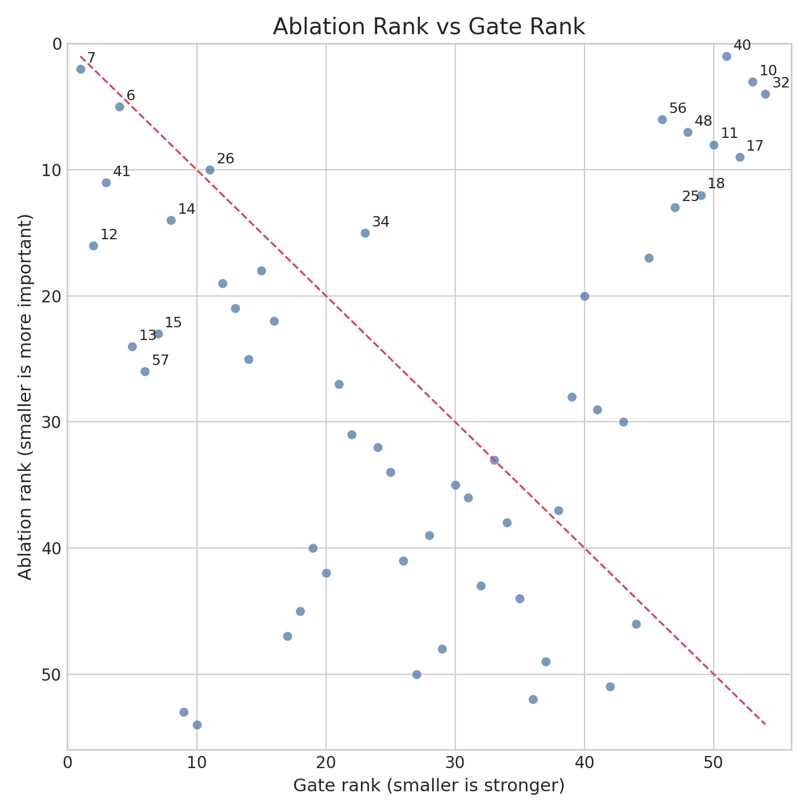
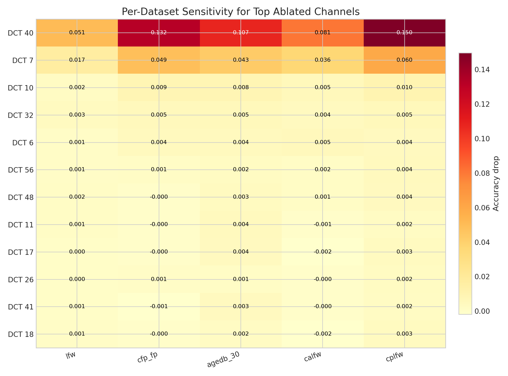
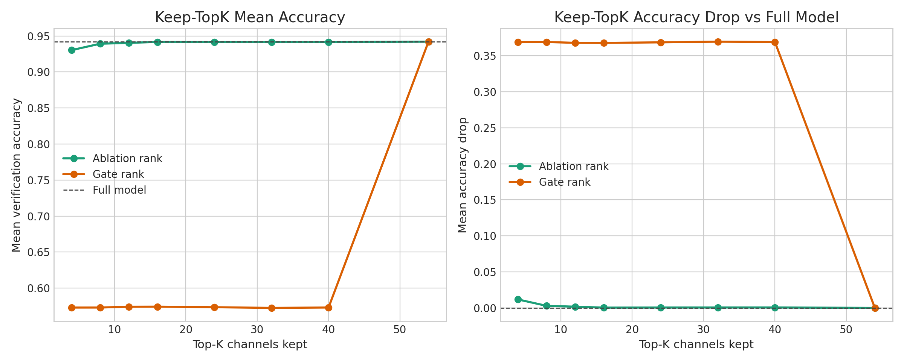

# Full Model 高频通道依赖实验报告

## 1. 实验目的

本实验关注的是一个非常具体的问题：

- 当人脸识别模型只接收 `high-frequency DCT` 输入时，它到底依赖哪些高频通道来完成身份判别？
- 这种“真实依赖度”是否和 gate 模型给出的高权重通道一致？

这里的分析对象是 `full model`，也就是完整训练得到的高频识别模型。  
`gate model` 仅作为一个对照排序来源，用来比较“门控分数高”的通道，是否真的也是 `full model` 最依赖的通道。

---

## 2. 实验在做什么

### 2.1 输入形式

模型输入不是 RGB 三通道，而是图像经过 DCT 分解后保留下来的高频分量。

当前设置下：

- 低频通道固定排除
- 剩余高频 DCT 索引共 `54` 个
- 每个 DCT 索引在三个颜色分量上各有一份
- 所以识别模型输入总通道数为 `54 x 3 = 162`

### 2.2 两类搜索

我们做了两类搜索：

1. `leave-one-out ablation`
   每次去掉一个 DCT 通道，观察五个验证集平均精度下降多少。
   精度掉得越多，说明模型越依赖这个通道。

2. `keep-topk search`
   按某种排序，仅保留前 `k` 个通道，其他通道全部置零，观察模型还能保留多少识别能力。

这里比较了两种排序来源：

- `ablation rank`：来自真实消融实验
- `gate rank`：来自 gate 模型的门控权重排序

---

## 3. 验证设置

实验在五个标准验证集上进行：

- `LFW`
- `CFP-FP`
- `AgeDB-30`
- `CALFW`
- `CPLFW`

`full model` 的基线平均精度如下：

- Mean accuracy: `0.9421`
- LFW: `0.9942`
- CFP-FP: `0.9574`
- AgeDB-30: `0.9362`
- CALFW: `0.9343`
- CPLFW: `0.8883`

这些数值说明，当前 `full model` 在只使用高频输入的前提下，已经具备较强的人脸验证能力，因此后续的通道依赖分析是有意义的。

---

## 4. 高频输入的直观理解

为了理解“高频输入里到底保留了什么信息”，我们参考了一个额外的 `UNet reconstruction` 可视化实验。  
它的作用不是直接排序通道重要性，而是帮助我们建立直觉：高频分量虽然丢掉了很多低频平滑信息，但仍然保留了与身份相关的纹理、边缘和局部结构。

下面这张总览图展示了三类内容：

- `Original`：原始人脸图像
- `High-Frequency`：仅根据高频分量恢复出的可视化结果
- `UNet Reconstruction`：UNet 从高频输入恢复出的重建图像

下面再给出两个单样本示例：

从这些图可以得到一个很重要的直觉：

- 高频输入并不是“纯噪声”
- 它仍然保留了眼周、鼻翼、嘴角、轮廓边缘、局部纹理等身份相关信息
- 因此识别模型可能会对少数几个关键高频通道形成高度依赖

---

## 5. 主要实验结果

### 5.1 最核心的发现

本轮实验最重要的结论有五点：

1. `full model` 对高频通道的依赖极不均匀，呈现出明显的“头部少数通道 + 大量长尾通道”结构。
2. `DCT 40` 是最关键的通道，去掉后平均精度下降 `0.1042`。
3. `DCT 7` 是第二关键通道，去掉后平均精度下降 `0.0409`。
4. 从第三名开始，通道重要性快速衰减，说明真正承载主要身份信息的通道数量并不多。
5. gate 模型给出的高权重排序，与 `full model` 的真实依赖排序整体并不一致。

### 5.2 最重要的前 10 个通道

按 `leave-one-out` 平均精度下降排序，前 10 个最重要通道如下：

| Rank | DCT index | Mean accuracy drop | Gate rank |
| --- | ---: | ---: | ---: |
| 1 | 40 | 0.1042 | 51 |
| 2 | 7 | 0.0409 | 1 |
| 3 | 10 | 0.0068 | 53 |
| 4 | 32 | 0.0045 | 54 |
| 5 | 6 | 0.0037 | 4 |
| 6 | 56 | 0.0022 | 46 |
| 7 | 48 | 0.0018 | 48 |
| 8 | 11 | 0.0014 | 50 |
| 9 | 17 | 0.0011 | 52 |
| 10 | 26 | 0.0008 | 11 |

这里最值得注意的是：

- `DCT 40` 明明是最关键通道，但在 gate 排名里只排第 `51`
- `DCT 10`、`32`、`11`、`17` 这些关键通道，在 gate 排名里也都非常靠后

这已经说明：`gate model` 的高权重通道，并不能直接代表 `full model` 真正依赖的通道。

---

## 6. 图表分析

### 6.1 通道重要性柱状图

这张图说明：

- `DCT 40` 的重要性远高于其他通道，是一个非常突出的“主导通道”
- `DCT 7` 也明显强于后续多数通道
- 整体分布呈现快速衰减的长尾结构

这意味着模型并没有平均使用全部 54 个高频通道，而是把主要识别能力集中在很少数几个通道上。

### 6.2 真实依赖度 vs gate 权重

这里的相关性结果为：

- `Spearman(drop, gate_score) = -0.109`

这说明：

- gate 分数高，并不代表这个通道对 `full model` 真正重要
- 从整体上看，两种排序几乎没有正相关

也就是说，gate 学到的偏好和 full model 的真实判别依赖，并不是一回事。

### 6.3 Ablation rank vs gate rank

如果 gate 排名和真实依赖一致，那么点应该大致落在对角线附近。  
但这张图显示：

- 大量关键通道偏离对角线很远
- `DCT 40` 偏离最显著：它在 ablation 中排第 `1`，但在 gate 中排第 `51`

这进一步证明，gate 排名不能直接拿来指导 full model 的通道裁剪。

### 6.4 不同验证集的敏感度热图

热图显示：

- `DCT 40` 在五个验证集上都很重要
- 尤其在 `CFP-FP` 和 `CPLFW` 上，去掉 `DCT 40` 的影响更大
- `DCT 7` 也是一个跨数据集稳定重要的通道

这说明这些关键通道不是只对某一个数据集有效，而是在不同测试条件下都承担了稳定的身份判别功能。

### 6.5 Keep-topK 曲线

这是本次实验最有操作意义的一张图：

- 只保留 `ablation top-8` 通道，平均精度仍有 `0.9392`
- 只保留 `ablation top-16` 通道，平均精度达到 `0.9417`，几乎恢复 full model
- 但如果按 `gate rank` 保留前 `8` 或前 `16` 个通道，平均精度只有 `0.57` 左右

这个结果很强地说明：

1. `full model` 的识别信息高度集中在极少数高频通道中
2. 真实消融排序是有效的通道压缩依据
3. gate 排序并不适合作为 full model 的压缩依据

---

## 7. 结论

综合来看，本轮实验可以得到三个明确结论：

1. `full high-frequency recognition model` 对高频通道的利用非常稀疏，不是平均依赖全部通道。
2. 少数通道，尤其是 `DCT 40` 和 `DCT 7`，承担了远高于其他通道的识别贡献。
3. `gate model` 的通道权重排序，不能代表 `full model` 的真实依赖结构，因此不能直接拿来做通道选择。

换句话说，如果我们希望进一步压缩高频输入空间，应当优先相信 `full model` 的真实消融结果，而不是 gate 分数。

---

## 8. 下一步计划

下一步我们会继续围绕 `full model` 做更激进的通道压缩实验，而不是围绕 `gate model`。

重点计划如下：

1. **只保留 2 个通道**
   验证模型是否已经把最核心的身份信息集中到了极少数 DCT 分量上。

2. **只保留 4 个通道**
   观察在极强压缩条件下，识别精度是否仍然保持可用。

3. **只保留 8 个通道**
   这是最有希望的一组设置，因为当前结果已经表明，仅保留 top-8 通道时性能下降非常小。

后续所有 `2 / 4 / 8` 通道实验，都会以 `full model` 的真实消融排序为参照，而不是使用 gate 模型的门控排序。

这一步想回答的核心问题是：

- 是否存在一个极低维的高频子空间，足以支撑大部分身份判别能力？
- 如果答案是肯定的，那么这些通道将为后续更轻量的输入设计、通道裁剪和频域蒸馏提供非常明确的依据。

